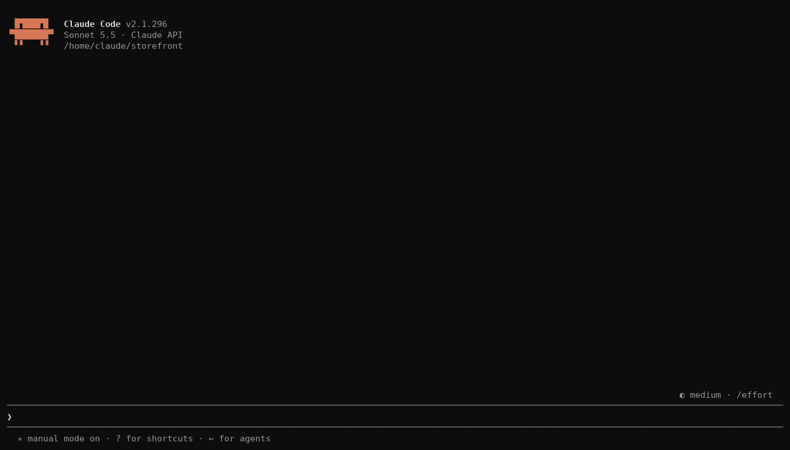
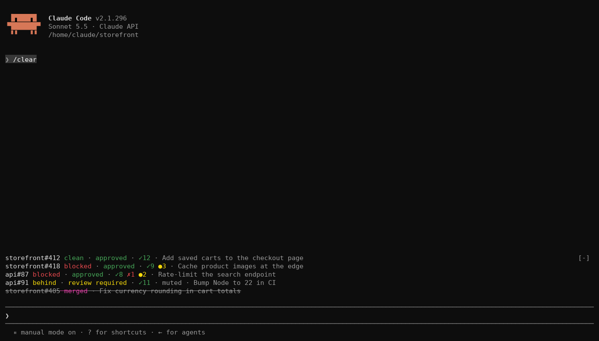
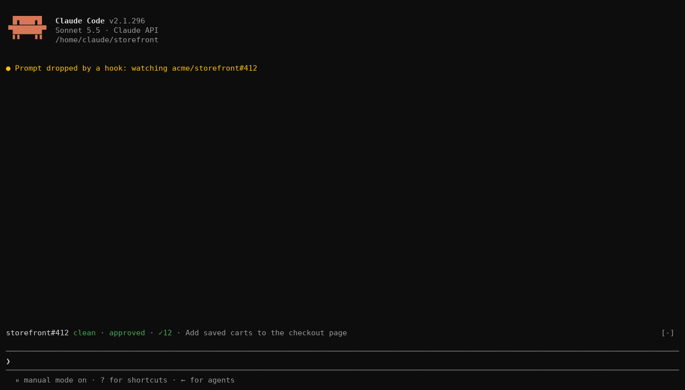
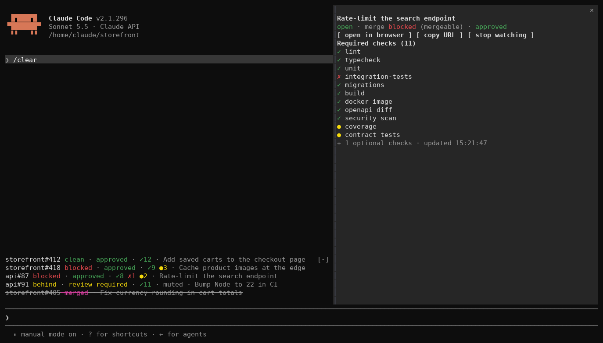

# cc-pr-tracker

Watch GitHub pull requests without leaving your Claude Code session.

Paste a PR URL, or let Claude open one, and it gets one line above the prompt: merge state, review decision and required checks, refreshed every minute. When a check flips or the merge state moves you get a toast, a one-second flash and a sound. You keep working; the PR tells you when it needs you.





One PR is always one line; the details panel names the checks. [Reading the line](#reading-the-line) explains each part.

The plugin is built on Claude Code **function hooks**: TypeScript that runs inside Claude Code's own process, instead of shell-command hooks. They are in early access, behind an environment variable that the quick start sets.

## Requirements

- A Claude Code build with function hooks (tested on 2.1.269), with `CLAUDE_CODE_ENABLE_FUNCTION_HOOKS=1` set. The quick start shows where.
- [GitHub CLI](https://cli.github.com) (`gh`), logged in with access to the repos you watch. Check with `gh auth status`.
- Optional: macOS for sounds (`afplay` with the system sounds) and `open`. On Linux, `xdg-open` is tried when `open` is absent, and there is no sound.
- Optional: [cmux](https://cmux.com) for pane flashes and workspace notifications. Outside cmux an alert is the toast, the strip and the sound.

## Quick start

1. Turn function hooks on. Add this to `~/.claude/settings.json` (create the file if it does not exist, or merge the `env` key into what is there). Without it the plugin installs fine but does nothing.

   ```json
   {
     "env": {
       "CLAUDE_CODE_ENABLE_FUNCTION_HOOKS": "1"
     }
   }
   ```

   This also loads the hooks module of any other installed plugin that ships one. For a single session instead, prefix the command: `CLAUDE_CODE_ENABLE_FUNCTION_HOOKS=1 claude`.

2. Install from GitHub. The repo is its own marketplace:

   ```sh
   claude plugin marketplace add sezaakgun/cc-pr-tracker
   claude plugin install cc-pr-tracker@cc-pr-tracker
   ```

3. Start `claude`, paste a PR URL as the whole prompt and press Enter. No model turn runs; Claude Code shows `Prompt dropped by a hook: watching owner/repo#N`. Several URLs at once, separated by spaces or newlines, are all watched.

   

4. The line appears above the prompt and fills in within a few seconds.

5. Paste the same URL again to stop watching.

If the line shows `gh failed: …` instead, see [Troubleshooting](#troubleshooting).

To try it without installing, or to hack on it, clone and load it for one session:

```sh
git clone https://github.com/sezaakgun/cc-pr-tracker
cd cc-pr-tracker
claude --plugin-dir .
```

The repo's own `.claude/settings.json` sets the variable, so sessions started inside the folder need no prefix.

## Use

- **Watch a PR**: paste its URL as the whole prompt, several at once if you like. Or mention URLs in a normal prompt: the prompt runs as usual and the PRs are watched too.
- **Watch a PR Claude creates or talks about**: nothing to do. Any open PR whose URL appears in Claude's answer is watched, and so is the URL `gh pr create` prints when it runs through the Bash tool. Subagent answers are not scanned.
- **Open a PR**: Cmd+click its `repo#number` (needs a terminal that renders hyperlinks), or hover the line and press `open`.
- **See every check**: hover the line and press `details`. A side panel lists every required check and every failing optional one, linked to its run when the run has an https link.

  

- **Silence a PR**: hover the line and press `mute`. The line keeps updating but that PR no longer toasts, flashes or plays a sound; the line ends in `· muted`. Press `unmute` to turn alerts back on.
- **Silence every PR**: open `/config` and turn on **Mute all PR alerts**. It applies at once, is saved across sessions, and every line ends in `· muted` while it is on. Turn it off to get alerts back; PRs you muted one by one stay muted.
- **Stop watching**: hover the line and press `×`, or paste the same URL again as the whole prompt. A paste of several URLs toggles each one; a URL inside a normal prompt never stops anything.

Several PRs stack, one line each, in the order you added them.

## Reading the line

- **Label**: `repo#number`, then `draft`, `merged` or `closed` when the PR is not simply open. A merged or closed PR keeps its line until you stop it.
- **Merge state** is GitHub's own value, lowercased. Green (`clean`, `has_hooks`) means mergeable now. Yellow (`behind`, `unstable`) means update the branch or an optional check failed. Red (`blocked`, `dirty`) means a required check or review is missing, or there are conflicts. Gray (`draft`, `unknown`) needs no action; `unknown` usually resolves on the next poll.
- **Review decision** is `approved` in green, `changes requested` in red, `review required` in yellow, or `no review` in gray when the repo has no review rules.
- **Checks** count only the required ones: `✓N` passed, `✗N` failed or cancelled, `●N` pending. Skipped checks are not counted and show as `○` only in the details panel. Failing optional checks are summarised as `(+N optional ✗)` and listed there too.
- **`· refresh failed`** in red at the end means the last poll errored and the line shows the previous values.

## Alerts

Every poll is compared with the previous one. A required check changing bucket (for example `pending → fail`, or a new check appearing) or the merge state moving (for example `blocked → clean`) triggers:

- a toast in the session, for example `my-service#42 lint: pending → fail`
- a one-second white strip above the prompt reading `● PR checks changed`
- a sound on macOS: Basso when a required check just failed, Glass for any other change, including a cancelled check
- inside cmux: a flash of the session's own pane and a notification that marks its workspace unread, so the change reaches you from another workspace

Two things never alert: the first load of a PR, and a move into or out of GitHub's temporary `unknown` merge state.

## Troubleshooting

- **Pasting a URL just sends it to the model.** Function hooks are off. Check `CLAUDE_CODE_ENABLE_FUNCTION_HOOKS` is set in `~/.claude/settings.json` under `env` (see Quick start), and that the plugin is loaded with `/plugins`.
- **`gh failed: …` on the line.** Run `gh pr view <url>` in a terminal. Usually `gh` is not logged in or has no access to that repo.
- **`Required checks: none reported` in details.** The repo has no branch protection with required checks. The line still shows the merge state and review.
- **No sound.** Only macOS with `/System/Library/Sounds` present plays sounds.
- **Hover buttons never appear.** Your terminal does not report the mouse. Cmd+click and pasting the URL again still work.
- **Cmd+click does nothing.** Your terminal does not render hyperlinks. Hover the line and press `open`.
- **Watched PRs disappeared.** The session restarted or the plugin hot-reloaded; watched PRs live in memory (see Limits). Paste the URLs again.

## Limits

- Polling is every 60 seconds through `gh`, one GraphQL call per PR per poll.
- Watched PRs live in memory. Restarting the session, or a plugin reload after its files change, forgets them.
- The area above the prompt has a limited number of rows, about half the terminal. Very many PRs will scroll.
- A headless `claude -p` run never draws. Only interactive terminal sessions show the UI.
- A PR created in the browser or from another terminal must be pasted. Claude only auto-watches PRs whose URL appears in its answer or in `gh pr create` output.
- Merged and closed PRs keep polling until you stop them.
- Only `github.com` URLs are recognised; GitHub Enterprise hosts are not.
- GitHub's rate limit is not handled specially; a refused poll shows `refresh failed` and the next one retries.

## How it works

The plugin is one hooks module, `hooks/register.tsx`. It hooks five events:

- `prompt.submit` reads PR URLs from your prompt and starts or stops watching.
- `turn.complete` reads PR URLs from Claude's final answer, and `tool.call` on Bash reads the URL `gh pr create` prints.
- `ui.render` on `AbovePrompt` draws the lines; on `Pane` it draws the details panel.
- `session.start` sets up a 60-second timer that polls every watched PR.

Each poll is one read-only GraphQL call through `gh api graphql`: the PR's title, state, merge state and review decision, plus every check on its head commit with GitHub's own `isRequired` flag. The plugin maps check states to the same `pass` / `fail` / `pending` / `cancel` / `skipping` buckets that `gh pr checks` uses. A failed poll keeps the previous values and marks the line `refresh failed`, so a network blip is not reported as a change. Every call has a 30-second timeout.

## Develop

```sh
bun test                              # unit tests for the pure helpers
claude plugin validate .claude-plugin/plugin.json   # lists the hooked events and $ calls
claude plugin validate .                            # checks the marketplace manifest
```

For type checking, run the built-in `/plugin-types` command inside this folder in a Claude Code session. It writes `.claude/types/`, which is git-ignored; `tsc` fails with a missing `claude-code` module until it exists. Then:

```sh
bunx -p typescript tsc -p .
```

Edits hot-reload into a running session. If a reload fails partway, the transcript says so; restart the session.

## License

MIT. See [LICENSE](LICENSE).
