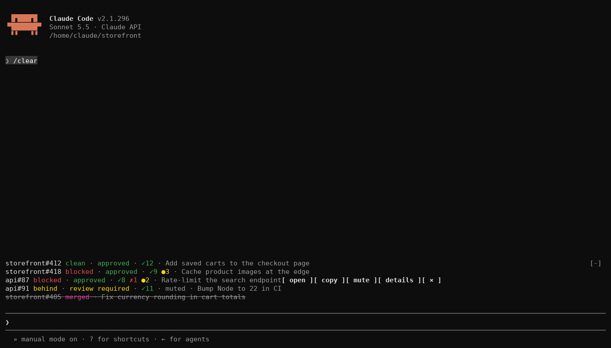
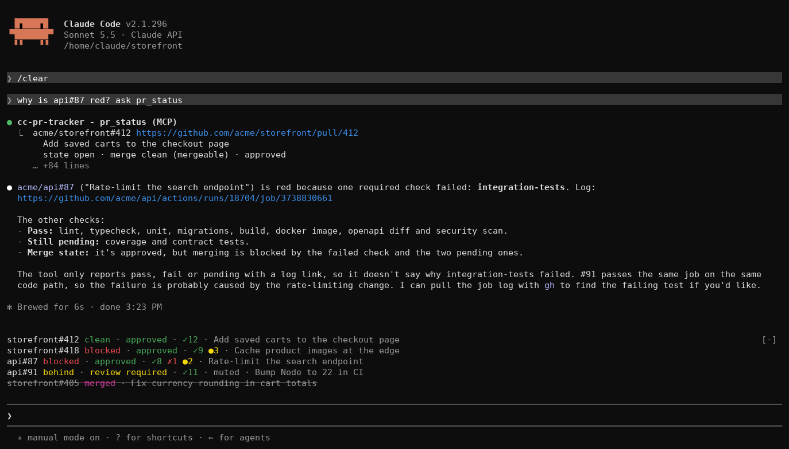
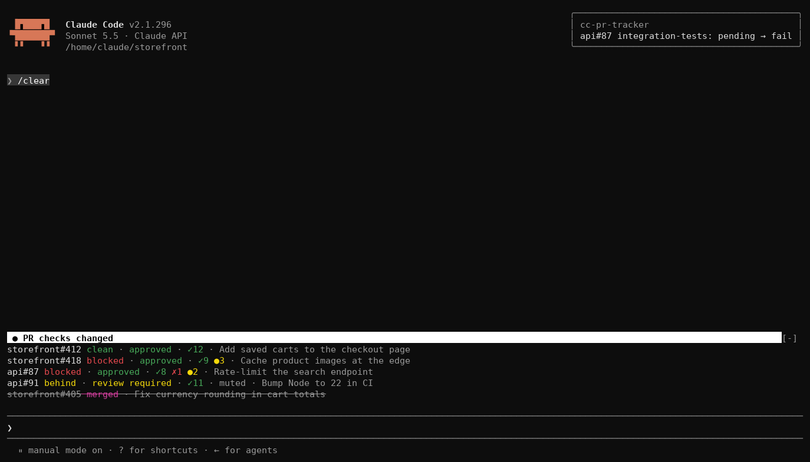
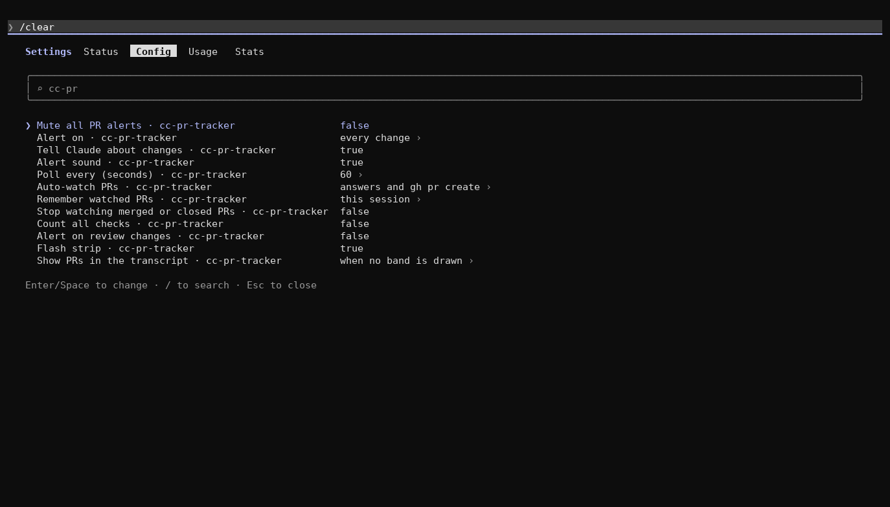

# cc-pr-tracker

Watch GitHub pull requests without leaving your Claude Code session.

Paste a PR URL, or let Claude open one, and it gets one line above the prompt: merge state, review decision and required checks, refreshed every minute by default. When a check flips or the merge state moves you get a toast, a one-second flash and a sound, and Claude gets a note with the failing check's log link. You keep working; the PR tells you when it needs you.

Claude can also ask for a PR's status itself, the list survives restarts, and `/config` controls what alerts and how often PRs are polled.


One PR is always one line; hovering it shows its buttons and the details panel names the checks. [Reading the line](#reading-the-line) explains each part.

The plugin is a [Claude Code mod](https://code.claude.com/docs/en/plugins/mods/overview): a plugin whose TypeScript hooks run inside Claude Code's own process, instead of shell-command hooks. Mods are on by default from Claude Code 2.1.287.

## Requirements

- Claude Code 2.1.289 or later for everything (`claude --version`; mods load by default from 2.1.287). Older builds still watch and alert, but keep the list in memory only, send Claude no note and cannot copy. Before 2.1.287, function hooks were in early access and load only with `CLAUDE_CODE_ENABLE_FUNCTION_HOOKS=1` set; 2.1.287 and later ignore that variable, so remove it if you set it.
- [GitHub CLI](https://cli.github.com) (`gh`), logged in with access to the repos you watch. Check with `gh auth status`.
- Optional: macOS for sounds (`afplay` with the system sounds) and `open`. On Linux, `xdg-open` is tried when `open` is absent, and there is no sound.
- Optional: [cmux](https://cmux.com) for pane flashes and workspace notifications. Outside cmux an alert is the toast, the strip, the sound and the note to Claude.

## Quick start

1. Install from GitHub. The repo is its own marketplace:

   ```sh
   claude plugin marketplace add sezaakgun/cc-pr-tracker
   claude plugin install cc-pr-tracker@cc-pr-tracker
   ```

2. Start `claude`, paste a PR URL as the whole prompt and press Enter. No model turn runs; Claude Code shows `Prompt dropped by a hook: watching owner/repo#N`. Several URLs at once, separated by spaces or newlines, are all watched.

   

3. The line appears above the prompt and fills in within a few seconds.

4. Paste the same URL again to stop watching. Run `/plugin` to confirm the mod loaded: a dim line under the tabs reads `N mods active · cc-pr-tracker`.

If the line shows `gh failed: …` instead, see [Troubleshooting](#troubleshooting).

To try it without installing, or to hack on it, clone and load it for one session:

```sh
git clone https://github.com/sezaakgun/cc-pr-tracker
cd cc-pr-tracker
claude --plugin-dir .
```

The repo's own `.claude/settings.json` still sets `CLAUDE_CODE_ENABLE_FUNCTION_HOOKS=1` for builds before 2.1.287; newer ones ignore it.

## Use

On Claude Code 2.1.289 or later the list comes back when you resume a session, Claude is told about changes, and the copy buttons work. Older builds watch and alert as before, in memory only.

- **Watch a PR**: paste its URL as the whole prompt, several at once if you like. Or mention URLs in a normal prompt: the prompt runs as usual and the PRs are watched too.
- **Watch a PR Claude creates or talks about**: nothing to do. Any open PR whose URL appears in Claude's answer is watched, and so is the URL `gh pr create` prints when it runs through the Bash tool. Subagent answers are not scanned.
- **Use the line's buttons**: hover a line and five buttons appear at its end: `open`, `copy`, `mute` (or `unmute`), `details` and `×`. They need a terminal that reports the mouse.

  

- **Open a PR**: Cmd+click its `repo#number` (needs a terminal that renders hyperlinks), or hover the line and press `open`.
- **Copy a PR's URL**: hover the line and press `copy`, or press `copy URL` in the details panel. Over SSH the terminal's clipboard is reached through OSC 52.
- **Ask Claude about a PR**: Claude has a `pr_status` tool for the PRs you watch. It polls them when called and answers with the state, merge state, review decision, every required check with its log link and any failing optional check, so "why is my PR red?" needs no `gh` call. Claude passes a URL or `owner/repo#number` for one PR, or nothing for all of them; a PR that is not watched gets the list of those that are.

  

- **See every check**: hover the line and press `details`. A side panel shows the title, the state, merge state and review, three buttons (`open in browser`, `copy URL`, `stop watching`), then every required check and every failing optional one, linked to its run when the run has an https link. Its last line counts the optional checks and says when the PR was last polled.

  

- **Silence a PR**: hover the line and press `mute`. The line keeps updating but that PR no longer toasts, flashes, plays a sound, notifies cmux or tells Claude; the line ends in `· muted`. Press `unmute` to turn alerts back on.
- **Silence every PR**: open `/config` and turn on **Mute all PR alerts**. It applies at once, is saved across sessions, and every line ends in `· muted` while it is on. Turn it off to get alerts back; PRs you muted one by one stay muted.
- **Stop watching**: hover the line and press `×`, or paste the same URL again as the whole prompt. A paste of several URLs toggles each one; a URL inside a normal prompt never stops anything.

Several PRs stack, one line each, in the order you added them.

The list is kept with the session. Resuming it (`claude --resume`, `--continue`) watches the same PRs again, minus any merged or closed since; a new session starts empty. Set **Remember watched PRs** to `this project` to have every new session in the directory pick the list up instead. `/clear` drops the PRs Claude brought in and keeps the ones you pasted.

## Reading the line

- **Label**: `repo#number`, then `draft`, `merged` or `closed` when the PR is not simply open. A merged or closed PR keeps its line until you stop it, shortened to its label, its state in magenta (merged) or gray (closed) and its title, all struck through.
- **Merge state** is GitHub's own value, lowercased. Green (`clean`, `has_hooks`) means mergeable now. Yellow (`behind`, `unstable`) means update the branch or an optional check failed. Red (`blocked`, `dirty`) means a required check or review is missing, or there are conflicts. Gray (`draft`, `unknown`) needs no action; `unknown` usually resolves on the next poll.
- **Review decision** is `approved` in green, `changes requested` in red, `review required` in yellow, or `no review` in gray when the repo has no review rules.
- **Checks** count only the required ones: `✓N` passed, `✗N` failed or cancelled, `●N` pending. Skipped checks are not counted and show as `○` only in the details panel. Failing optional checks are summarised as `(+N optional ✗)` and listed there too.
- **`· refresh failed`** in red means the last poll errored and the line shows the previous values.
- **`· muted`**, dimmed, means the PR does not alert, because you muted it or **Mute all PR alerts** is on.
- **Title** comes last, so it is what a narrow terminal cuts.

## Alerts

Every poll is compared with the previous one. A required check changing bucket (for example `pending → fail`, or a new check appearing) or the merge state moving (for example `blocked → clean`) triggers:

- a toast in the session, for example `my-service#42 lint: pending → fail`
- a one-second white strip above the prompt reading `● PR checks changed`
- a sound on macOS: Basso when a required check just failed, Glass for any other change, including a cancelled check
- inside cmux: a flash of the session's own pane and a notification that marks its workspace unread, so the change reaches you from another workspace
- a note in the conversation that you do not see but Claude reads on its next turn, marked as an automated notice with GitHub's text quoted, for example `[cc-pr-tracker: automated status notice, …] org/my-service#42 (…) changed: "lint: pending → fail". Newly failing required checks: "lint" https://…`



**Alert on**, **Alert sound** and **Tell Claude about changes** in `/config` (see Settings) narrow this. A muted PR gets none of these, the note included. Two things never alert: the first load of a PR, and a move into or out of GitHub's temporary `unknown` merge state.

## Settings

Open `/config`; the rows are under cc-pr-tracker. Each also takes `/config cc-pr-tracker.<field>=<value>`. A change applies at once, without a restart.



| Row | Field | Default | What it does |
| --- | --- | --- | --- |
| Mute all PR alerts | `muteAll` | off | Lines keep updating; nothing toasts, flashes, sounds, notifies cmux or tells Claude. Its help text says how many PRs are watched and muted. |
| Alert on | `alertOn` | every change | `every change`, `failures and ready to merge` (a required check newly failing, or the merge state turning green), or `failures only`. |
| Tell Claude about changes | `notifyClaude` | on | The note Claude reads after an alert. |
| Alert sound | `sound` | on | The macOS sounds; the toast, strip and cmux notification stay. |
| Poll every (seconds) | `pollSeconds` | 60 | 30 to 3600; a value outside is held to the nearer end. One GraphQL call per PR per poll. |
| Auto-watch PRs | `autoWatch` | answers and gh pr create | `answers and gh pr create`, `gh pr create only`, or `off`. Pasted URLs are always watched. |
| Remember watched PRs | `remember` | this session | `this session`: resuming it brings the list back, a new session starts empty. `this project`: every new session in the directory watches the list. |

## Troubleshooting

- **Pasting a URL just sends it to the model.** The mod did not load. Run `/plugin`: the dim `mods active` line should name cc-pr-tracker. If not, check `claude --version` is 2.1.287 or later, the plugin is enabled in the **Installed** tab, the session was not started with `--safe-mode`, and `disableAllHooks` is not `true` in your settings. On a build before 2.1.287, set `CLAUDE_CODE_ENABLE_FUNCTION_HOOKS=1`.
- **`gh failed: …` on the line.** Run `gh pr view <url>` in a terminal. Usually `gh` is not logged in or has no access to that repo.
- **`Required checks: none reported` in details.** The repo has no branch protection with required checks. The line still shows the merge state and review.
- **No sound.** Only macOS with `/System/Library/Sounds` present plays sounds.
- **Hover buttons never appear.** Your terminal does not report the mouse. Cmd+click and pasting the URL again still work.
- **Cmd+click does nothing.** Your terminal does not render hyperlinks. Hover the line and press `open`.
- **Claude does not know about a change.** The note needs Claude Code 2.1.289 or later and **Tell Claude about changes** on in `/config`; a muted PR, **Mute all**, or **Alert on** set narrower than the change sends none. Claude reads the note on its next turn, so ask after the toast.
- **Watched PRs disappeared.** They are kept with the session that watched them: resume it, or set **Remember watched PRs** to `this project`. A `/clear` drops the PRs Claude brought in. Paste the URLs again.

## Limits

- Polling is every 60 seconds by default (`pollSeconds` in `/config`) through `gh`, one GraphQL call per PR per poll.
- The watch list is stored per session, or per project directory under `remember: this project` (`$.store`); a hot reload keeps the lines as drawn (`$.state`). A session's list not polled for 30 days is deleted.
- The area above the prompt has a limited number of rows, about half the terminal. Very many PRs will scroll.
- A headless `claude -p` run never draws. Only interactive terminal sessions show the UI.
- A PR created in the browser or from another terminal must be pasted. Claude only auto-watches PRs whose URL appears in its answer or in `gh pr create` output.
- Merged and closed PRs keep polling until you stop them.
- Only `github.com` URLs are recognised; GitHub Enterprise hosts are not.
- GitHub's rate limit is not handled specially; a refused poll shows `refresh failed` and the next one retries.

## How it works

The plugin is one hooks module, `hooks/register.tsx`. It hooks these events:

- `prompt.submit` reads PR URLs from your prompt and starts or stops watching.
- `turn.complete` reads PR URLs from Claude's final answer, and `tool.call` on Bash reads the URL `gh pr create` prints.
- `ui.render` on `AbovePrompt` draws the lines; on `Pane` it draws the details panel.
- `session.start` reads the settings, restores the list, registers the `pr_status` tool and sets up the timer that polls every watched PR.
- `config.set` applies a settings change at once; `config.describe` adds the watched and muted counts to the Mute all row.
- `tool.call` on `mcp__cc-pr-tracker__pr_status` polls the asked PRs and answers that tool.
- `session.end` with reason `clear` drops the PRs Claude brought in.

An alert also calls `$.session.append` to add a user-role note Claude reads but you do not see. Because check names come from the PR's own workflows, the note says it is an automated notice and quotes every name GitHub supplies, capped at 100 characters.

The calls that arrived after 2.1.269 (`$.session.root`, `$.state`, `$.session.append`, `$.ui.copy`, the `session.end` event) are each guarded: on an older build the call fails, is logged once, and the plugin carries on in memory as 0.2 did.

Each poll is one read-only GraphQL call through `gh api graphql`: the PR's title, state, merge state and review decision, plus every check on its head commit with GitHub's own `isRequired` flag. Like `gh pr checks`, only the latest run of each check is kept: runs are grouped by app, workflow, event and name, so a re-run replaces the run it superseded while same-named checks from another workflow or event stay separate. The plugin maps check states to the same `pass` / `fail` / `pending` / `cancel` / `skipping` buckets that `gh pr checks` uses. A failed poll keeps the previous values and marks the line `refresh failed`, so a network blip is not reported as a change. Every call has a 30-second timeout.

## Develop

```sh
claude plugin test .                                  # register.test.ts (pure helpers) and hooks.test.ts (every hook against the engine, gh faked)
bunx @biomejs/biome@2.5.15 lint --error-on-warnings   # lint only (biome.jsonc); the code keeps its own style
claude plugin validate .                              # the manifests, and the events and $ calls the module uses
```

The tests need no login: nothing calls a model, and `gh` is answered by the tests. GitHub Actions (`.github/workflows/test.yml`) runs the validate and test steps on Claude Code 2.1.289 and the latest release, and the lint step, on every push to `main` and every pull request.

For type checking, load the plugin once (`claude --plugin-dir .`). Claude Code then writes this build's API types to `.claude-plugin/types/`, which is git-ignored and which `tsconfig.json` reads; `tsc` fails with a missing `claude-code` module until it exists. Then:

```sh
bunx -p typescript tsc -p .
```

Edits hot-reload into a running session. If a reload fails partway, the transcript says so; restart the session.

## License

MIT. See [LICENSE](LICENSE).
